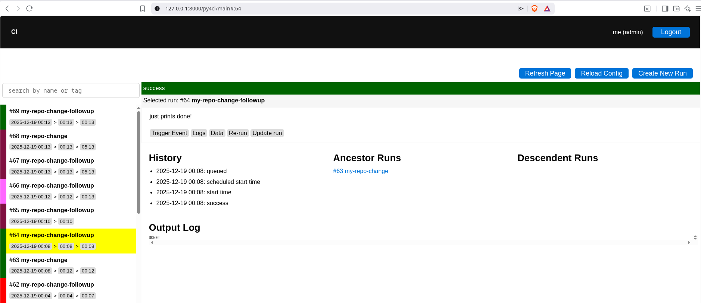

# py4CI

Py4ci is a general-purpose Continuous Integration (CI) system written in Python and built on py4web. It targets Linux systems only and is designed as a lightweight alternative to CI platforms such as Bamboo or Jenkins, particularly for small to medium deployments (approximately 1–1000 workers).

Py4ci supports both single-node and distributed execution models and can be integrated with Docker, Podman, and Nix-based environments.

Py4ci emphasizes:
- Minimal operational complexity
- Zero-configuration workers
- Explicit, reproducible execution environments
- Straightforward horizontal scaling

Py4ci is designed to require no agent installation or configuration on worker nodes.
Workers only need to have the following required system packages installed in order to execute jobs:

- ``dtach``
- ``curl``

Moreover, the server must be able to ``ssh -A {user}@{worker}`` into the workers without a password.

## Run it (with uv)

    mkdir apps
    pushd apps
    git clone {py4ci}
    popd
    uv run --with-requirements apps/py4ci/requirements.txt py4web run apps

## Nomenclature

### Tasks

A task is a static description of a unit of work. Tasks are defined by users in YAML and consist of:

- a unique name
- a shell script to execute

Tasks may also declare optional attributes, including:

- execution timeout
- periodicity (scheduled execution)
- dependencies on other tasks
- external or internal triggers
- additional execution metadata

Tasks are immutable definitions; they do not represent execution state.

### Runs

A run is a concrete execution instance of a task. Each run is uniquely identified by a run ID (numeric).

A run maintains a complete execution history, including:

- enqueue time
- scheduled start time
- actual start time
- execution host (worker)
- completion time

Each run has a status, one of:

    queued | started | running | success | failed | broken | jammed | skipped

A run also records:

- full log output
- ancestor runs (triggers)
- descendant runs (runs triggered by this run)

### Triggers and Run Chaining

Runs may be triggered in multiple ways:

- by an HTTP POST request (e.g., a GitHub webhook on push)
- by the successful completion of another run

This mechanism allows chaining and pipelines of tasks.

The run that triggers another run is called its ancestor.
Runs triggered as a result of a run are called its descendants.

### Scheduling and Concurrency

Runs execute in parallel whenever possible, subject to the following constraints:

- each worker executes at most one run at a time
- a single physical host may execute multiple runs concurrently by registering
multiple workers with distinct names but the same hostname or IP address

This model enables controlled parallelism while maintaining explicit resource limits.

## Execution Model

- The web server runs a background process called the scheduler.
- When an event triggers a run, the scheduler selects an available worker and starts the run via SSH.
- Upon completion, the worker notifies the server using an HTTP POST callback.
- The scheduler then retrieves the run’s output and artifacts from the worker using SCP.
- All run metadata and state transitions are stored in a single database table.
- At this time there is no retry logic.

### Server Configuration

In ``py4ci/settings.py`` configure:

- ``APP_BASE_URL``: the url to be used by the workers to reach your app.
- ``SMTP_SSL``, ``SMTP_SERVER``, ``SMTP_SENDER``, ``SMTP_LOGIN``, ``SMTP_TLS``: The email settings used by the authentication logic.
- ``OAUTH2GOOGLE_*``, ``OAUTH2GITHUB_*``, etc. Optional Single Sign configuration.

### Workers Configuration

All remaining Py4ci configuration is defined in YAML files located under ``py4ci/ci_config``.

The configuration may be split across any number of YAML files.
File names are not significant, and configuration files may be organized into arbitrary subdirectories.

At startup, Py4ci recursively reads all YAML files in this directory and merges them into a single internal configuration data structure.

For example:

    # in file py4ci/ci_config/workers.yaml
    workers:
      worker01:
        host: me@127.0.0.1
        queues:
        - default
      worker02:
        host: me@192.168.1.23
        queues:
        - default
        - fast

Or:        

    # in file py4ci/ci_config/localhost_workers.yaml
    workers:
      worker01:
        host: user@127.0.0.1
        queues:
        - default

    # in file py4ci/ci_config/remote_workers.yaml
    workers:
      worker02:
        host: user@192.168.1.23
        queues:
        - default
        - fast

- The names of the configuration files is not significant.
- The names of the workers is not significant.
- The names of the queues is not significant.
- The host is specified in the form {user}@{hostname-or-IP}, where {user} must be the same user account that runs the web server and must be able to establish passwordless SSH access to the worker nodes.

You should also specify "administrators":

    # in file py4ci/ci_config/administrator.yaml
    administrators:
      - username1
      - username2

or

    # in file py4ci/ci_config/administrator1.yaml
    administrators:
      - username1

    # in file py4ci/ci_config/administrator2.yaml
    administrators:
      - username2

The administrator username is a py4ci username. It allows the logged-in user, if an administrator, to manage tasks through the web UI (create/delete/edit and resubmit).
An administrator can see and manage all runs.

### Tasks Configuration

Tasks are configured in a similar way to workers:

For example here is the definition of a periodic heartbeat task that tells time (date):

    # in file py4ci/ci_config/periodic_tasks.yaml
    tasks:
      my-heartbeat:
        enabled: true
        description: checks the date every 1h
        queues:
        - default
        tags:
        - heartbeat
        - isperiodic
        period: 1h
        debounce: 1m
        priority: 0
        timeout: 180s
        command: |
          date
        authorized_users:
        - me

- The name of the configuration file is not significant.
- ``my-heartbeat`` is the name assigned to this task.
- This task may only execute on the default queue, provided that at least one worker is assigned to that queue.
- ``tags`` are arbitrary labels used exclusively for filtering and searching runs in the web UI.
- ``authorized_users`` specifies the Py4ci usernames of users permitted to view runs for this task.
- By default, only one run per task may execute at any given time. If a new trigger occurs   while a run is already executing, the new run is skipped.
- The ``debounce`` parameter extends this skip window for an arbitrary duration after the most recent run has started.
- Time-based fields (``period``, ``debounce``, ``timeout``) accept the following units: {n}s, {n}m, {n}h, {n}d, {n}w, where n is a numeric value. Note: all time values are displayed in seconds in the web UI.

For example, the following shows the definition of a task triggered by an HTTP POST request that fetches a repository when invoked:

    # in file py4ci/ci_config/my-pipeline.yaml
    tasks:
      my-repo-change:
        enabled: true
        description: list files when repo changes
        queues:
        - default
        tags:
        - repo
        triggered_by:
        - ssh_url: git@github.com:web2py/py4web.git
          branches:
          - master
        priority: 0
        timeout: 180s
        command: |
          git clone https://github.com/web2py/py4web.git
          pushd py4web
          ls -l
          popd
          echo "DONE!"
        authorized_users:
        - me

This assumes a github "on commit" webhook and will trigger when a new commit to master is pushed.

Below is a task that triggers when a run of the previous task (``my-repo-change``) completes successfully:

    # in file py4ci/ci_config/my-pipeline.yaml
    tasks:
      ...
      my-repo-change-followup:
        enabled: true
        description: just prints done!
        queues:
        - default
        triggered_by:
        - task: my-repo-change
        priority: 0
        timeout: 180s
        command: |
          echo "DONE!"
        authorized_users:
        - me

A trigger is either an HTTP POST (gtihub webhook) or a task.
